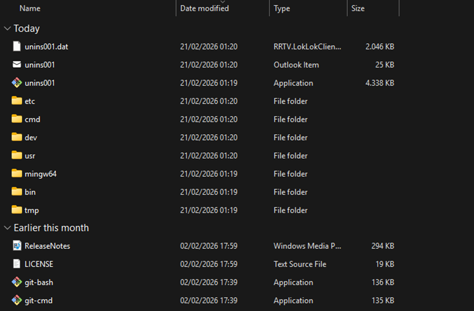
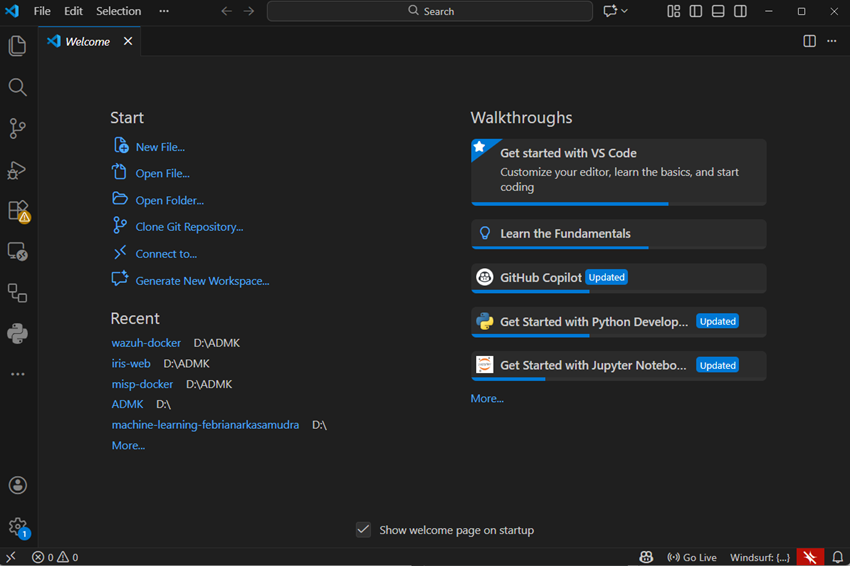
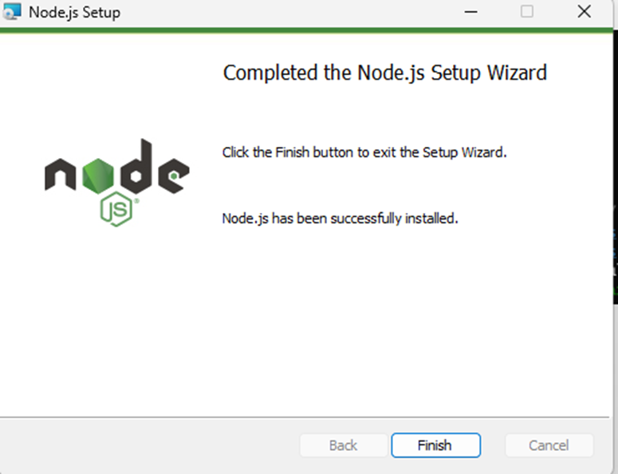
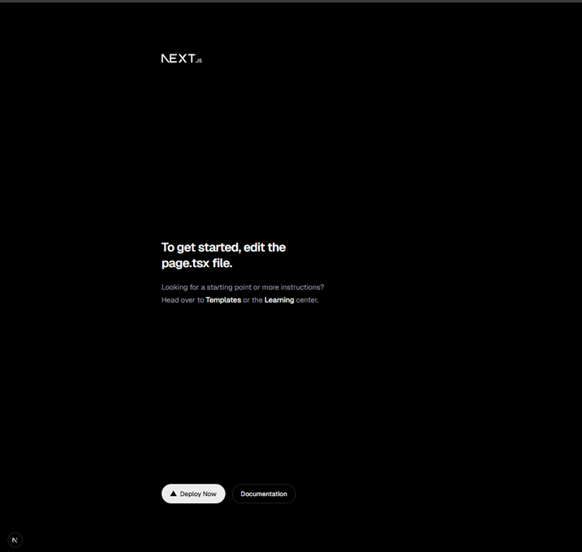
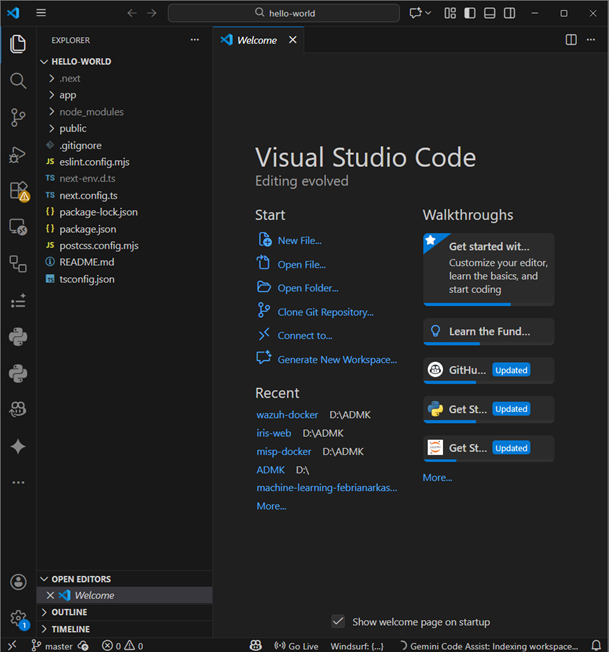
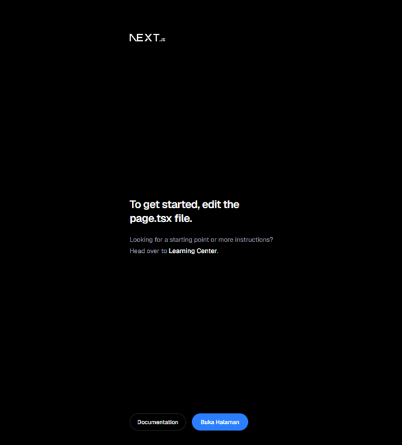
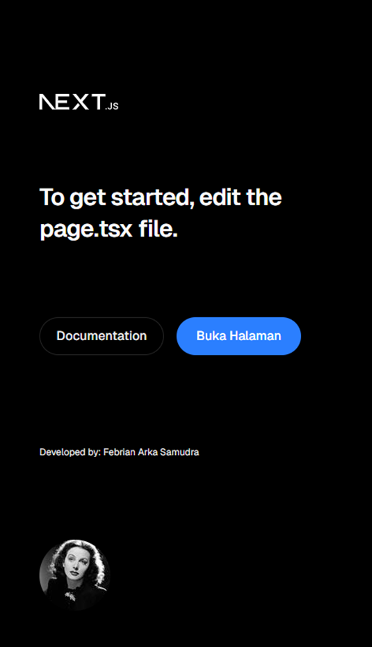

This is a [Next.js](https://nextjs.org) project bootstrapped with [`create-next-app`](https://nextjs.org/docs/app/api-reference/cli/create-next-app).

## Getting Started

First, run the development server:

```bash
npm run dev
# or
yarn dev
# or
pnpm dev
# or
bun dev
```

Open [http://localhost:3000](http://localhost:3000) with your browser to see the result.

You can start editing the page by modifying `app/page.tsx`. The page auto-updates as you edit the file.

This project uses [`next/font`](https://nextjs.org/docs/app/building-your-application/optimizing/fonts) to automatically optimize and load [Geist](https://vercel.com/font), a new font family for Vercel.

## Laporan Praktikum

|  | Pemrograman Berbasis Framework 2026 |
|--|--|
| NIM |  2341720066|
| Nama |  Febrian Arka Samudra |
| Kelas | TI - 3I |

## Practicum 1 - Setting Up the Development Environment

### Question 1
**Explain the uses of Git, VS Code, and NodeJS that you have installed in this practical session!**

Answer : 
Git
Git is a version control system used to track code changes, manage different versions of a project, and collaborate with other developers.

Visual Studio Code (VS Code)
Microsoft Visual Studio Code is a source code editor used to write and manage code efficiently. It provides features like syntax highlighting, extensions, debugging tools, and Git integration.

Node.js
Node.js is a JavaScript runtime that allows developers to run JavaScript outside the browser, mainly for backend development. It also includes npm to manage project packages.

## Question 2
**Provide screenshots showing that each of these tools has been successfully installed on your device!**

Git 


VS Code


Node.js


## Practicum 2 — Creating First React Project using Next.js

### Question 1
**Explain the following terms: TypeScript, ESLint, Tailwind CSS, App Router, Import Alias, and Turbopack**

- TypeScript extends JavaScript by adding static typing, which helps minimize errors and enhances overall code reliability.

- ESLint is a code analysis tool used to enforce coding standards and identify potential problems.

- Tailwind CSS is a utility-based CSS framework that enables faster UI development through ready-to-use classes.

- App Router in Next.js is a folder-based routing system that handles navigation within the application.

- Import Alias helps shorten and simplify file paths, making the code more organized and readable.

- Turbopack is a high-speed bundler designed to boost development performance, particularly during builds and live reloads.

### Question 2
**Explain the function of folders and files in the React project structure**

From the project structure that I observed:

| File / Folder | Function |
|---|---|
| `app/` | Holds the core pages and handles the application's routing system
| `public/` | Contains static assets like images, icons, and other media files |
| `styles/` | Manages global CSS and styling configurations |
| `package.json` | Lists project dependencies and defines available scripts |
| `next.config.js` | Provides configuration settings for the Next.js project |
| `node_modules/` | Stores all installed packages needed for the application to function |

### Question 3
**Provide proof that the steps have been successfully completed**





## Practicum 3 — Adding React Component Button
### Question 1
**Provide proof that the steps have been successfully completed**



## Practicum 4 — Writing Markup with JSX
### Question 1
**What is the use of the syntax `user.imageUrl`?**

The syntax user.imageUrl is used to access the imageUrl property from the user object. This property typically contains an image URL, such as a profile picture, which can then be displayed on a webpage or used in components like <Image /> in React or Next.js.

### Question 2
**Provide proof that the steps have been successfully completed**


