## Laporan Praktikum

|  | Pemrograman Berbasis Framework 2026 |
|--|--|
| NIM |  2341720066|
| Nama |  Febrian Arka Samudra |
| Kelas | TI - 3I |
---

### Step 1 – Environment Check
1. Open the terminal or command prompt.
2. Run the following commands:
	- `node -v`
	- `npm -v`
	- Ensure Node.js and npm are installed. If not, install from: https://nodejs.org/en/download
	- `git -v`
	- If not installed, download from: https://git-scm.com/install/windows

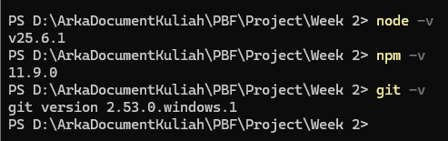

### Step 2 – Creating a Next.js Project
1. Create a new directory and navigate to your working directory.
2. Run:
	- `npx create-next-app@13.4.7 <project-name>`
	- Wait for the installation to finish.
3. Enter the project folder.

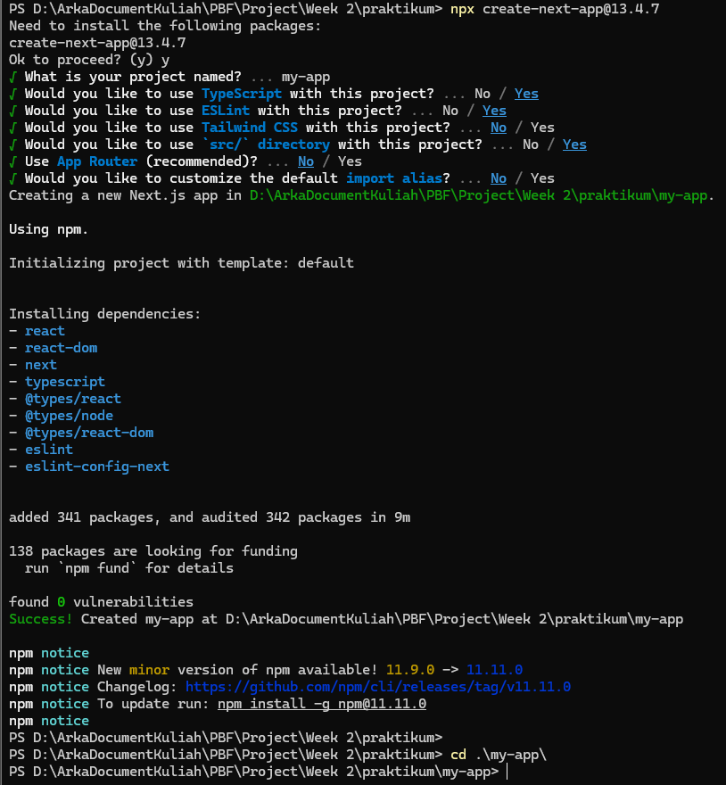

### Step 3 – Running the Development Server
1. Enter the project folder (if not already).
2. Run the app:
	- `npm run dev`
3. Open your browser and go to: http://localhost:3000

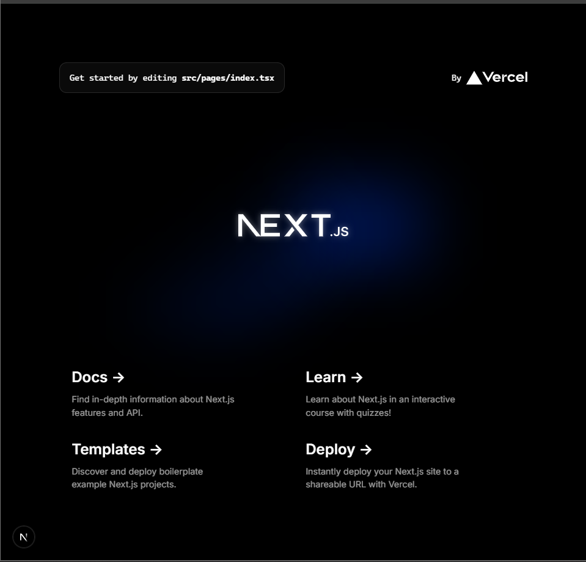

### Step 4 – Understanding the Folder Structure
- `pages/` → for page routing
- `public/` → static assets
- `styles/` → CSS files
- `package.json` → project configuration
- `.gitignore` → tells Git which files/folders to ignore

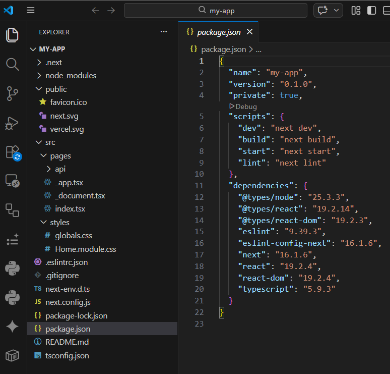
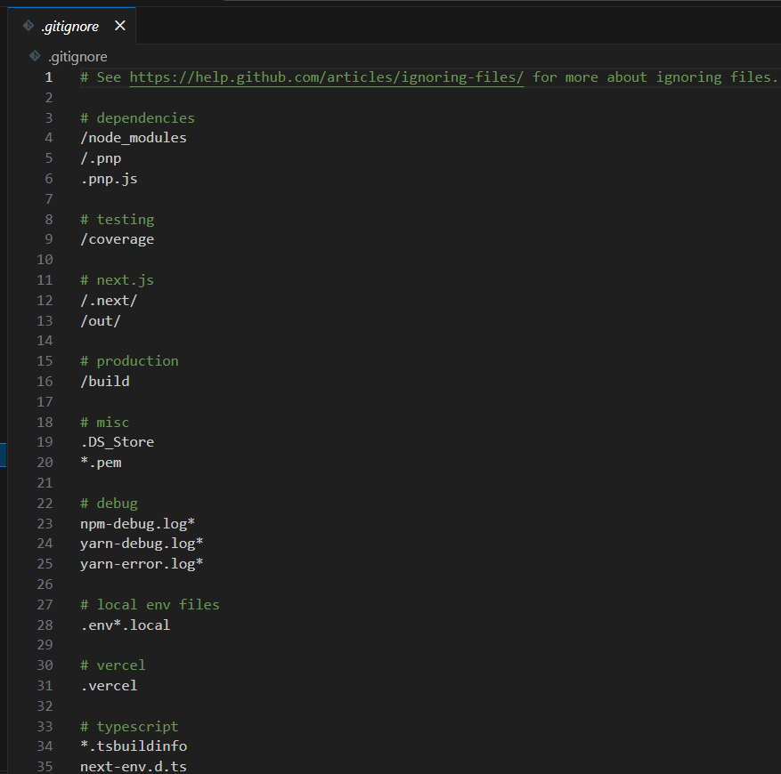

### Step 5 – Modifying the Main Page
1. Open:
	- `pages/index.js`
2. Change the content as needed.
3. Save and check the browser for updates.

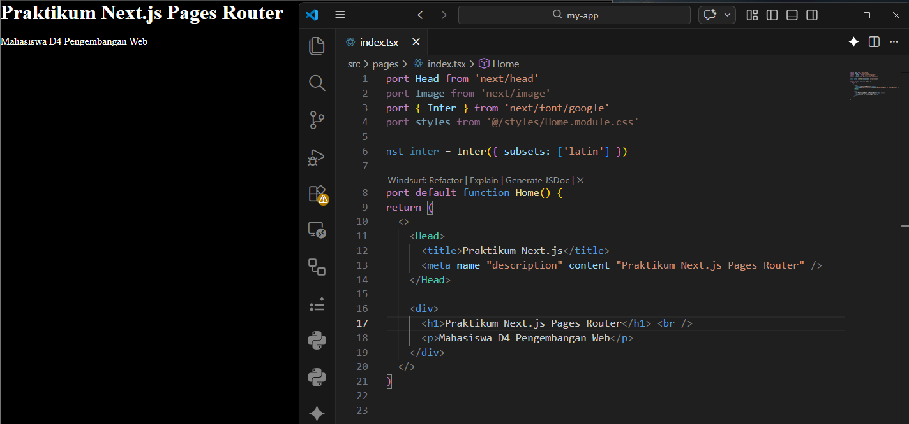

### Step 6 – Modifying the API
1. Open the `api` folder.
2. Edit `hello.ts`.
3. Access via browser: http://localhost:3000/api/hello
4. (Optional) Add Chrome extensions and run Chrome browser.

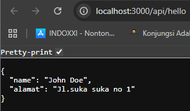
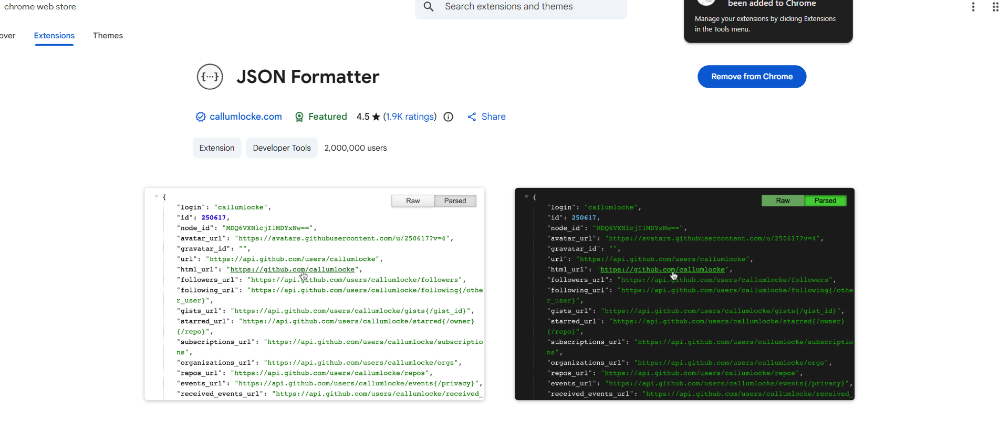
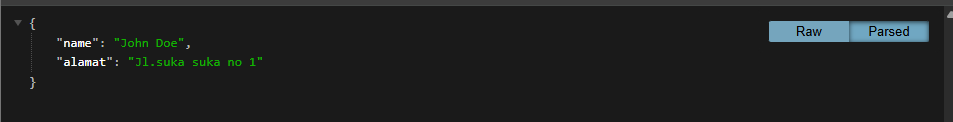

### Step 7 – Modifying the Background
1. Open `_app.tsx`.
2. Modify as needed.
3. Check the result at localhost.

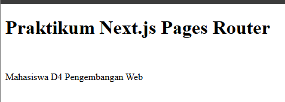

### Step 8 – (Optional) VSCode Extensions Setup
- Auto Rename Tag
- Windsurf Plugin
- Console Ninja
- ES7+ React/Redux/React-Native/JS snippets
- ESLint extension
- Git Graph
- Prettier
- Asa

## Practical Tasks
### Task 1 (Mandatory)
- Create a new page `about.js` in the `pages` folder.
- Display:
  - Student Name
  - Student ID (NIM)
  - Study Program

### Task 2 (Enrichment)
- Add at least one navigation link from the main page to the about page.

**Answer:**

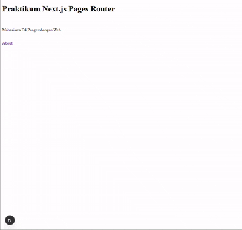
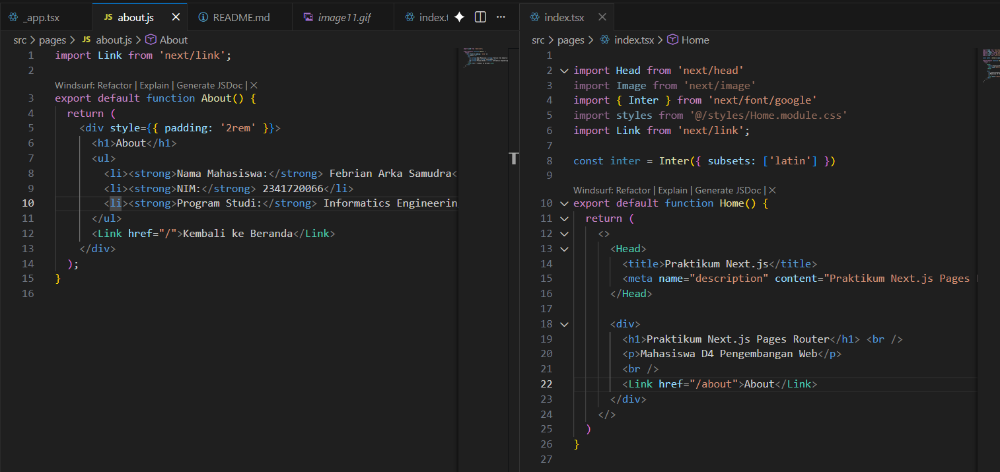

## Reflection Questions
1. Why is the Pages Router called file-based routing?
	- **Answer:** Pages Router in Next.js is called file-based routing because each file inside the `pages` directory automatically becomes a route in the application. The file structure directly maps to the URL structure, making routing intuitive and easy to manage.
2. What is the difference between Next.js and standard React (CRA)?
	- **Answer:** Next.js is a React framework that provides features like server-side rendering, static site generation, and file-based routing out of the box. Create React App (CRA) is a tool for bootstrapping React projects but does not include these advanced features by default.
3. What is the function of the command `npm run dev`?
	- **Answer:** `npm run dev` starts the development server, enabling hot reloading and allowing you to see changes in real time as you develop your application.
4. What is the difference between `npm run dev` and `npm run build`?
	- **Answer:** `npm run dev` runs the app in development mode with features like hot reloading, while `npm run build` creates an optimized production build of the app, ready for deployment.
